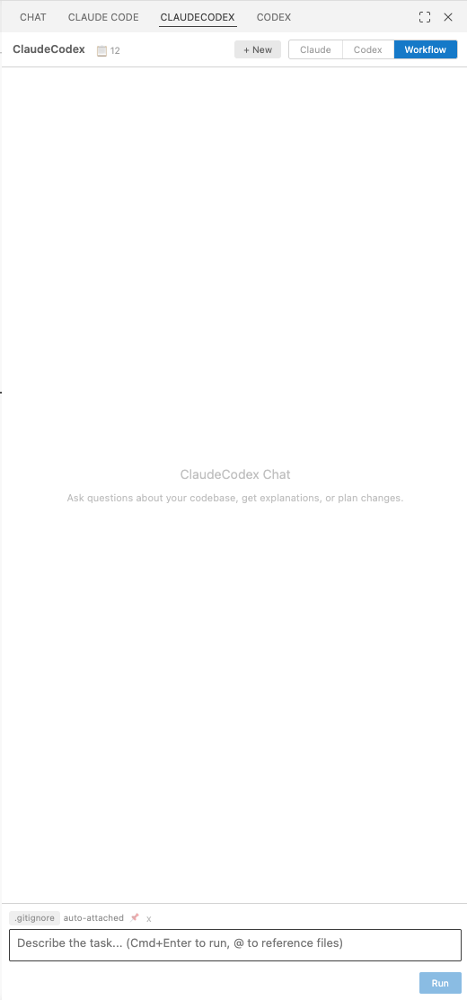

# ClaudeCodex

**A multi-agent coding pipeline for VS Code.** Claude Code plans and implements. Codex reviews and audits. No model reviews its own output.

[](https://code.visualstudio.com/)
[](https://nodejs.org/)
[](LICENSE)



---

## Why

AI coding assistants are powerful, but they have a structural problem: the same model writes the code and reviews it. There is no adversarial pressure. The model produces a plan, agrees with its own plan, implements it, and declares success.

Knowledge doesn't fix this. You can write detailed `CLAUDE.md` files, custom skills, persistent memory with engineering principles — and the model will cite your principles verbatim while violating them in the same response. It will have the right instruction in context and still make the wrong call.

**The pattern:**

- A churn prediction pipeline that should take one pass takes 5 iterations because the model reads one function from a reference file, misses four others, and requires manual correction each round.
- An opportunity value formula where the model proposes the wrong grouping key twice — referencing fields that don't exist on the entity — despite having "architecture first, then data" saved in its own persistent memory.
- A multi-service debugging task where the model diagnoses a "data content mismatch" instead of tracing the resolution architecture. The fix was already in the codebase for a different endpoint. Same pattern, same service — unfound.

**The core insight:** knowledge doesn't guarantee execution. What's needed is structural enforcement — separation of author and reviewer.

---

## How It Works

```text
User prompt (natural language or feature spec)
    │
    ▼
 [Plan]            Claude (read-only)  ── explores codebase, produces structured plan
    │
    ▼
 [Review Plan]     Codex  (read-only)  ── adversarial review: PASS or REVISE
    │
    ▼
 [Fix Plan]        Claude (read-only)  ── revises plan using review feedback
    │
    ▼
 [Human Approval]                      ── user reviews plan before any code is written
    │
    ▼
 [Implement]       Claude (write)      ── applies code changes per approved plan
    │
    ▼
 [Audit]           Codex  (read-only)  ── checks implementation against plan: PASS or FIX_REQUIRED
    │
    ▼
 [Document]        Claude (read-only)  ── generates spec artifacts (spec.md, plan.md, tasks.md)
```

**Key design decisions:**

1. **Two different models.** Claude plans and implements. Codex reviews and audits. No model reviews its own output.
2. **Read-only before write.** Plan, Review, Fix Plan, Audit, and Document stages cannot modify files. Code changes only happen after human approval.
3. **Gate-driven iteration.** If Review says REVISE, the plan gets revised with specific feedback. If Audit says FIX_REQUIRED, implementation is redone. The pipeline converges on correctness instead of hoping for it on the first pass.
4. **Structured artifacts.** Every run saves plan, review, audit verdict, diff, and manifest to `specs/` — full audit trail, not a chat log.

---

## Three Modes

| Mode | What it does |
| ---- | ----------- |
| **Ask** | Read-only Q&A — chat with Claude, no file changes |
| **Plan + Edit** | Single-agent coding — standard Claude Code experience |
| **Workflow** | Full multi-agent pipeline — the main event |

---

## Case Studies

Both features were given as natural-language descriptions. No file paths, no code snippets, no pre-written specs.

### Feature 1: Enable Step 0 Export in Journey Analysis

**Repo:** FastAPI analytics service with BigQuery backend
**Prompt:** *"Enable export users functionality from 1st step in journey analysis."*

| Stage | Agent | Time | Result |
| ----- | ----- | ---- | ------ |
| Plan | Claude | 139s | Found root cause: `n.step > 0` filter in 2 methods |
| Review | Codex | 33s | REVISE — found semantic bug in fallback logic |
| Fix Plan | Claude | 110s | Revised fallback + added 8 test methods |
| Human Approval | — | 178s | Approved revised plan |
| Implement | Claude | 126s | 2 files changed, 11 tests added |
| Audit | Codex | 29s | PASS — 52 tests passed |
| Document | Claude | 109s | Generated spec artifacts |

**Total: ~12 minutes. Audit passed first try.**

**What the review caught:** The fallback path (`list(nodes)` when no candidates remain) would re-include the terminal node when `end_event` is set. Users who *completed* the journey would be exported as "dropoff users." This bug would pass all existing tests and only manifest in production with a specific configuration.

### Feature 2: Prune Subset Leaves in Drop-Off Analysis Tree

**Repo:** LLM orchestrator service, Python
**Prompt:** *"Prune leaves whose filter sets are subsets or duplicates of other leaves, keeping only the most specific leaves for heavy execution."*

| Stage | Agent | Time | Result |
| ----- | ----- | ---- | ------ |
| Plan | Claude | 151s | Designed `frozenset` signatures, encapsulated pruning, cascade logic |
| Review | Codex | 139s | REVISE — found 3 gaps |
| Fix Plan | Claude | 147s | Addressed all gaps, added 6 test methods |
| Human Approval | — | 60s | Approved |
| Implement | Claude | 104s | 3 files changed |
| Audit | Codex | 68s | PASS — 45/45 tests, 254 full suite |
| Document | Claude | 69s | Generated spec artifacts |

**Total: ~12 minutes. Audit passed first try.**

**What the review caught:**

- **Empty-signature guard missing.** Root-level leaves have no filters. Without `if not fa: continue`, every root leaf would be pruned — silent, catastrophic data loss.
- **Bottom-up cascade ordering.** Top-down cascade misses multi-level orphan chains.
- **Missing operator-awareness test.** `{equals, country=US}` and `{not_equal, country=US}` must be treated as distinct.

All three were plan-level bugs — caught before any code was written.

---

## Before vs After

| Aspect | Single AI Agent | ClaudeCodex Pipeline |
| ------ | --------------- | -------------------- |
| Planning | Inline with implementation | Separate read-only stage |
| Review | Self-review (no adversarial pressure) | Cross-model adversarial review |
| Human checkpoint | After code is written | Before code is written |
| Edge cases | Best effort | Enforced by review + audit gates |
| When bugs are caught | After implementation (or production) | In the plan, before code exists |
| Iteration | Manual back-and-forth | Automatic gate-driven convergence |
| Audit trail | Chat log | Structured artifacts (plan, review, audit, diff) |
| Rework | Common (3-5 iterations typical) | Rare (both cases: audit passed first try) |

---

## Features

- **Dual-vendor pipeline** — Claude Code (Anthropic) + Codex CLI (OpenAI), configurable models
- **`@` file references** — autocomplete, visual tags, click-to-open, pinned files
- **Session persistence** — multiple named sessions per workspace, full history
- **Retry from failed stage** — no restart from scratch
- **CLI session continuity** — chat after workflow continues in the same Claude session
- **Quality gates** — configurable test, lint, typecheck, and security scan commands
- **Patch budget** — confirmation required when changes exceed a line threshold
- **Token cost tracking** — per-message and session-level usage with USD estimates
- **Rich markdown rendering** — Shiki syntax highlighting, code block actions (copy, insert, open)
- **Structured artifacts** — every run saves plan, review, audit, diff, and manifest to `specs/`
- **Run retention** — auto-cleanup of oldest runs (configurable limit)
- **Extended thinking** — collapsible thinking sections for model reasoning
- **Clarification detection** — inline questions from the model surface as dialogs

---

## Prerequisites

- **VS Code** >= 1.105.0
- **Node.js** >= 20 LTS
- **Claude Code CLI** installed and authenticated — [install guide](https://docs.anthropic.com/en/docs/claude-code)
- **Codex CLI** installed and authenticated — [install guide](https://github.com/openai/codex)

---

## Install

### From Source

```bash
git clone https://github.com/HassaanSaleem/claude-codex-agent.git
cd claude-codex-agent

npm install
npm run package

code --install-extension claudecodex-0.1.0.vsix --force
```

Reload VS Code: `Cmd+Shift+P` → **Developer: Reload Window**

### Development

```bash
npm run compile       # Build extension + webview
npm run watch         # Watch mode (auto-rebuild)
npm run check-types   # TypeScript type check
npm run test:unit     # Vitest unit tests
npm run test:integration  # VS Code integration tests
```

---

## Configuration

Open **Settings** → search `ClaudeCodex`:

| Setting | Default | Description |
| ------- | ------- | ----------- |
| `claudeCodex.claudeCliPath` | `claude` | Path to Claude Code CLI |
| `claudeCodex.codexCliPath` | `codex` | Path to Codex CLI |
| `claudeCodex.claudeModel` | *empty* | Model override for Claude (e.g., `sonnet`, `opus`) |
| `claudeCodex.codexModel` | *empty* | Model override for Codex (e.g., `o3`, `gpt-4o`) |
| `claudeCodex.maxIterations` | `3` | Fix-loop budget before halting |
| `claudeCodex.maxPlanRevisions` | `2` | Max auto-revisions from review feedback |
| `claudeCodex.patchBudget` | `500` | Max lines changed before confirmation |
| `claudeCodex.testCommand` | *empty* | Test command (empty = skip) |
| `claudeCodex.lintCommand` | *empty* | Lint command (empty = skip) |
| `claudeCodex.typecheckCommand` | *empty* | Type check command (empty = skip) |
| `claudeCodex.securityScanCommand` | *empty* | Security scan command (empty = skip) |
| `claudeCodex.cliTimeout` | `3600` | Per-CLI invocation timeout (seconds) |
| `claudeCodex.gateTimeout` | `300` | Per-gate command timeout (seconds) |
| `claudeCodex.pipelineTimeout` | `3600` | Overall pipeline timeout (seconds) |
| `claudeCodex.runDirectory` | `specs` | Artifacts directory relative to workspace |
| `claudeCodex.runRetentionLimit` | `20` | Max run directories to retain |

---

## Architecture

```text
src/
├── extension.ts              # VS Code activation, composition root
├── domain/                   # Types, interfaces, constants
├── services/                 # Pipeline orchestration, chat, artifacts, gates, sessions
├── infra/                    # CLI wrappers (Claude agent, Codex agent, subprocess)
├── webview/                  # React UI (chat, pipeline, components)
└── utils/                    # Parsers, classifiers, helpers
```

**Tech stack:** TypeScript 5.6+ (strict), React 18.3, Zod 3.23, esbuild, Shiki, VS Code Extension API

---

## How It Integrates

ClaudeCodex wraps your existing Claude Code and Codex CLI installations. Any `CLAUDE.md` files, custom skills, persistent memory, or configurations you already have flow through automatically — the pipeline adds structure and gates around them.

```text
┌─────────────────────────────────┐
│         VS Code Extension       │
│  (orchestration, UI, sessions)  │
└──────────┬──────────┬───────────┘
           │          │
     ┌─────▼──┐  ┌───▼────┐
     │ Claude │  │ Codex  │
     │  CLI   │  │  CLI   │
     └────────┘  └────────┘
     Plan         Review
     Fix Plan     Audit
     Implement
     Document
```

---

## License

[MIT](LICENSE)

---

## Contributing

Feedback, questions, and PRs welcome. Open an issue or submit a pull request.
